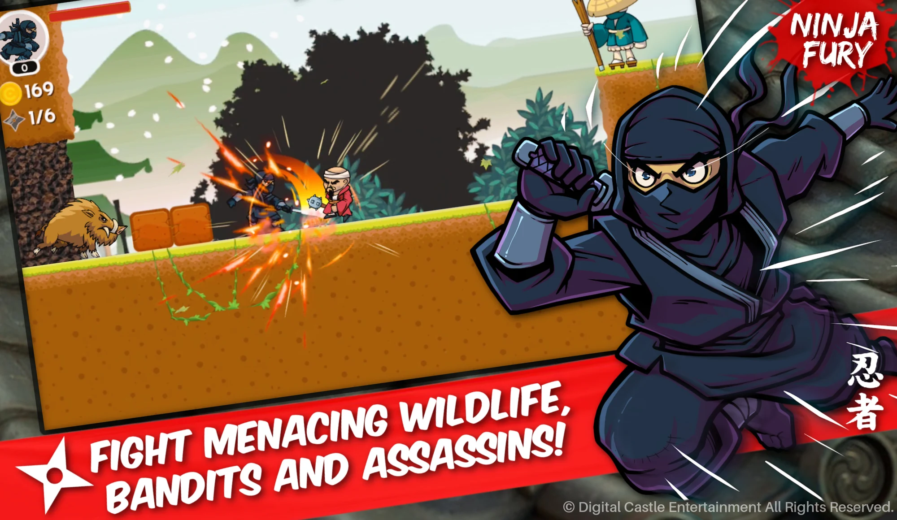
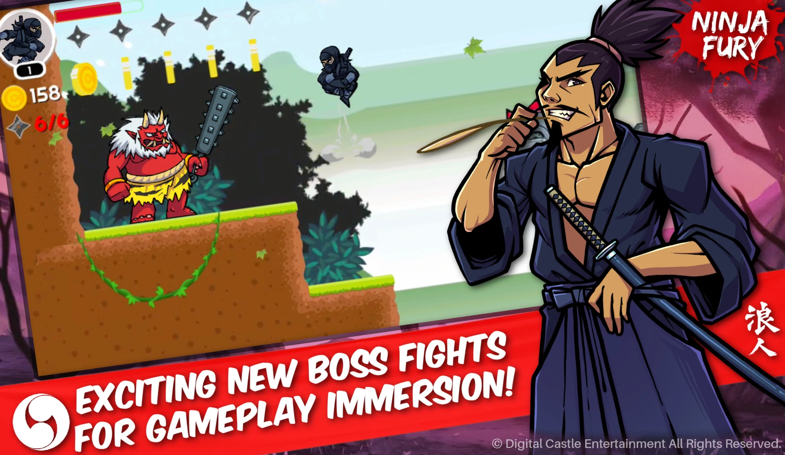
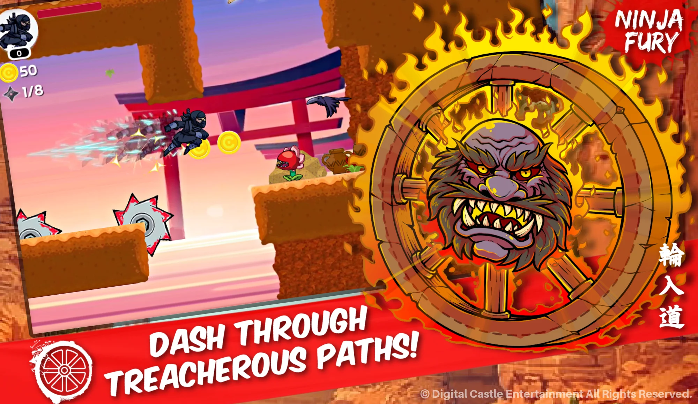
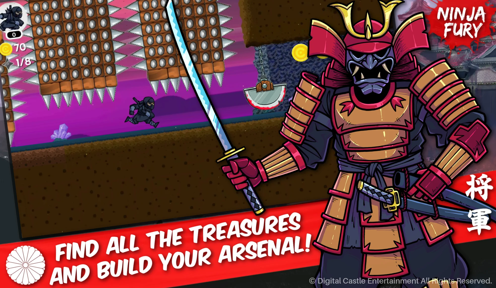

# 🎮 Epic Hero: Kingdom At War

## 📌 Overview
Epic Hero: Kingdom At War is an engaging puzzle-based adventure game developed using Unity. The game challenges players to solve strategic pin-pulling puzzles to rescue the princess while navigating through dangerous dungeons filled with enemies and traps.

Players must think critically, collect treasures, and unlock new heroes while building their own kingdom through progression and rewards.

---

## 🚀 Features
- 🧩 Strategic pin-pulling puzzle mechanics  
- 🏰 Kingdom building and progression system  
- 👑 Rescue the princess through multiple challenging levels  
- 👹 Enemy encounters and dungeon-based gameplay  
- 💰 Collect gold, gems, and rewards  
- 🎁 Daily rewards and unlockable heroes  
- ⚔️ Select and upgrade elite warriors  
- 🎮 Smooth and intuitive gameplay controls  

---

## 🛠️ Technologies Used
- Unity (2D Game Development)  
- C#  
- Firebase (Analytics & Crashlytics)  
- AdMob (Monetization)  
- Android SDK  

---

## 🎯 My Role
- Designed and developed puzzle mechanics (pin system)  
- Implemented level progression and difficulty scaling  
- Developed enemy interaction and game logic  
- Integrated Firebase for analytics and crash reporting  
- Implemented AdMob ads for monetization  
- Designed UI/UX for better user engagement  
- Optimized performance for Android devices  

---

## 📱 Play Store Link
https://play.google.com/store/apps/details?id=com.rexenterprises.herorescuetwo

---

## 📸 Screenshots
(Add your screenshots here after uploading to Screenshots folder)

Example:

---

## 🎓 Teaching Value
This project can be used as a teaching example for:
- Puzzle game logic and mechanics  
- Problem-solving and level design  
- Game state management  
- UI/UX design in mobile games  
- Ad integration (AdMob)  
- Firebase integration in Unity projects  

---

## 📊 App Details
- 📥 Downloads: 50+  
- 📅 Released: July 3, 2022  
- 🔄 Last Update: Aug 2, 2024  
- 📱 Platform: Android  
- 🎮 Genre: Puzzle / Strategy  

---

## 📩 Contact
Muhammad Zeeshan  
📧 shani92527@gmail.com  